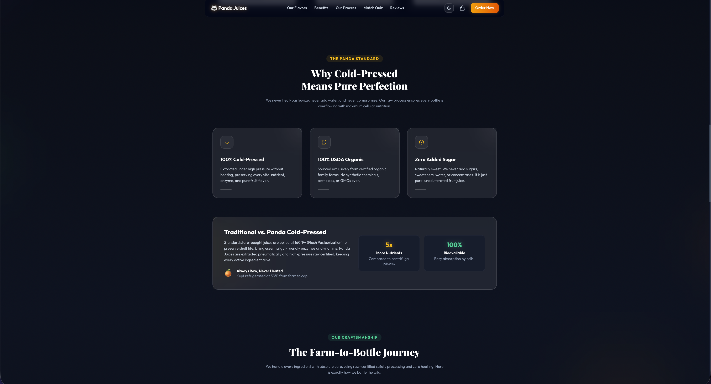
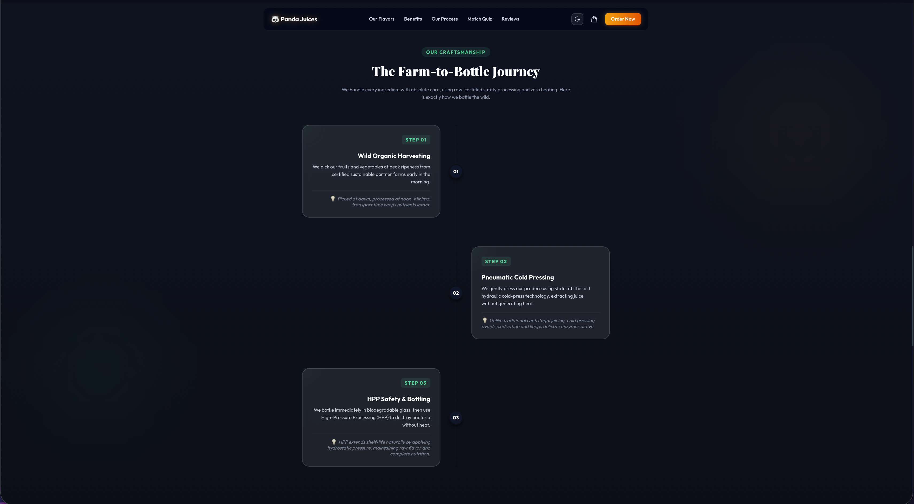
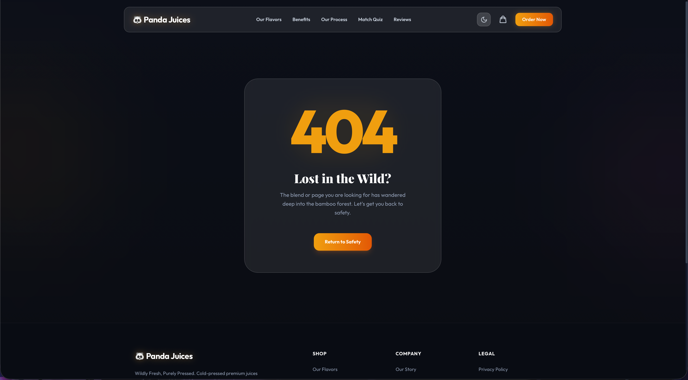

# 🐼 Panda Juices — Commercial E-Commerce & Product Showcase Template

<p align="left">
  
  
  
  
  
  
</p>

A modern, high-performance commercial product showcase and e-commerce website built with **Astro 5+**, **Tailwind CSS v4**, and **TypeScript**.

Designed for beverage, food, wellness, and luxury consumer goods brands that need interactive storytelling, high-conversion product showcases, and a fast shopping experience.

---

## 📸 Sample Preview

🔗 **Live Demo**: [**https://astrocommercialshowcase.netlify.app**](https://astrocommercialshowcase.netlify.app)

### 🏠 Home & Dynamic Product Swapper


### 🧃 Flavors & Nutrition Showcase


### 🌿 Brand Benefits & Pillars


### 🚜 Farm-to-Bottle Process Timeline


### 🧪 Interactive Match Quiz


### ⭐ Reviews & Footer


### 🚨 Themed 404 Error Page


---

## ✨ Features

- ⚡ **Zero-JS by Default**: Built on Astro for static performance and instant page loads.
- 🎨 **Tailwind CSS v4**: Fluid typography, responsive grids, and modern glassmorphism styling.
- 🌓 **Dynamic Theme Switcher**: Full Dark Mode & Light Mode support with persistent user preference in `localStorage`.
- 🧃 **Interactive Hero Product Swapper**: Dynamic flavor switcher that transitions background gradients, product details, nutrition stats, and bottle imagery without page reloads.
- 🧪 **Interactive Lifestyle Matcher Quiz**: 3-step recommendation questionnaire matching user wellness goals to specific product blends.
- 🚜 **Farm-to-Bottle Storyline**: Interactive timeline highlighting craftsmanship, quality standards, and cold-press technology.
- 💬 **Testimonial Slider**: Touch-friendly customer review carousel with animated star ratings and auto-pagination.
- 🛒 **Full Checkout Experience (`/buy`)**:
  - Cart state persistence with `localStorage`
  - Real-time tax & shipping calculations
  - Card, UPI/GPay, and Apple Pay payment tabs
  - Empty cart validation and interactive Order Confirmation screen
- 🚨 **Custom 404 Error Page (`/404`)**: Themed error landing page with quick navigation back to safety.
- 🤖 **CI/CD & Automation Ready**:
  - Pre-configured GitHub Actions workflow (`.github/workflows/lint-build.yml`)
  - Dependabot automated weekly dependency updates (`.github/dependabot.yml`)

---

## 📁 Project Structure

```text
/
├── .github/
│   ├── dependabot.yml              # Automated dependency update configuration
│   └── workflows/
│       └── lint-build.yml          # GitHub Actions CI build & check pipeline
├── public/
│   ├── pandafavi.png               # Site favicon and touch icon
│   └── images/                     # Product bottles & marketing photography
│       ├── mango-fusion.jpg
│       ├── berry-blast.jpg
│       └── green-detox.jpg
├── src/
│   ├── components/                 # Modular page components
│   │   ├── Navbar.astro            # Responsive navigation & theme toggle
│   │   ├── Hero.astro              # Dynamic product showcase & swatches
│   │   ├── Features.astro          # Brand pillars & comparison cards
│   │   ├── Process.astro           # Step-by-step production timeline
│   │   ├── Quiz.astro              # Interactive flavor matcher questionnaire
│   │   ├── Testimonials.astro      # Customer review slider
│   │   └── Footer.astro            # Footer links, newsletter form & socials
│   ├── data/
│   │   └── config.ts               # ⭐️ CENTRAL CONTENT CONFIGURATION
│   ├── layouts/
│   │   └── Layout.astro            # Base HTML wrapper, SEO meta, font links
│   ├── pages/
│   │   ├── index.astro             # Main Landing / Home Page
│   │   ├── buy.astro               # Cart & Checkout Page
│   │   └── 404.astro               # Custom 404 Error Page
│   └── styles/
│       └── global.css              # Global styles, Tailwind v4 imports, glass effects
├── astro.config.mjs                # Astro configuration & image domains
├── package.json                    # Dependencies and scripts
└── tsconfig.json                   # TypeScript configuration
```

---

## 🛠️ How to Customize This Template

This project is built around a **Single Source of Truth** pattern. You can edit almost all brand copy, products, pricing, features, and links directly inside [`src/data/config.ts`](src/data/config.ts) without touching component markup.

### 1. Brand Identity & Copy

Open `src/data/config.ts` and modify the top-level brand configuration:

```typescript
export const brandConfig = {
  name: "YourBrand",
  logo: "🐼 YourBrand Juices",
  tagline: "Wildly Fresh, Purely Pressed",
  description: "Your meta description for SEO...",
  contactEmail: "hello@yourbrand.com",
  // ...
};
```

---

### 2. Adding or Modifying Products (Flavors)

Products are configured in the `brandConfig.flavors` array in `src/data/config.ts`:

```typescript
{
  id: "mango-fusion",               // Unique slug (used for cart and swatches)
  name: "Panda Mango Fusion",        // Display name
  tagline: "Tropical Sunset in a Bottle",
  description: "A luscious, vibrant blend of...",
  bgColor: "from-amber-400 via-orange-500 to-red-600", // Tailwind gradient
  accentHex: "#f59e0b",             // Accent color for buttons and glows
  bottleBgHex: "#fbbf24",           // Swatch circle color
  image: "/images/mango-fusion.jpg", // Image in /public/images/
  price: "$5.99",
  rating: 4.9,
  reviewsCount: 142,
  nutrition: {
    calories: 110,
    sugar: "16g",
    vitaminC: "120%",
    organic: "100%"
  },
  benefits: ["Immune Support", "Digestive Health", "Natural Energy Boost"]
}
```

> 💡 **Image Tip**: Place product images inside `public/images/`. The template uses Astro's optimized `<Image />` component with automatic WebP generation.

---

### 3. Updating Production Steps & Features

Modify `brandConfig.features` and `brandConfig.process` in `src/data/config.ts` to customize your value propositions and farm-to-bottle timeline:

```typescript
process: [
  {
    step: "01",
    title: "Wild Organic Harvesting",
    description: "Your harvest description here...",
    details: "Extra detail shown on hover...",
  },
  // ...
];
```

---

### 4. Updating Testimonials

Modify `brandConfig.testimonials` in `src/data/config.ts`. You can use local images or remote URLs (Unsplash is pre-configured in `astro.config.mjs`):

```typescript
testimonials: [
  {
    name: "Marcus Vance",
    role: "Certified Fitness Trainer",
    rating: 5,
    comment: "Your customer quote...",
    avatar: "https://images.unsplash.com/...",
  },
];
```

---

### 5. Changing the Favicon

1. Drop your new icon into `public/` (e.g. `public/pandafavi.png`).
2. Update the `<link rel="icon">` tags in `src/layouts/Layout.astro`:
   ```html
   <link rel="icon" type="image/png" href="/pandafavi.png" />
   ```

---

## 💻 Development Commands

All commands are run from the project root:

| Command           | Description                                                   |
| :---------------- | :------------------------------------------------------------ |
| `npm install`     | Installs all project dependencies                             |
| `npm run dev`     | Starts the local dev server at `http://localhost:4321`        |
| `npm run build`   | Builds static assets and optimized HTML to `./dist/`          |
| `npm run preview` | Runs a local server to preview the `./dist/` production build |
| `npx astro check` | Runs TypeScript and Astro syntax diagnostic checks            |

---

## 🚢 Testing CI Workflows Locally (`act`)

You can test the GitHub Actions workflow locally using [act](https://github.com/nektos/act):

```bash
# Test the push event workflow
act push --container-architecture linux/amd64
```

---

## 🚀 Deployment

This template outputs static HTML and assets to `./dist/` and can be deployed to any static hosting provider:

- **Vercel**: `vercel deploy`
- **Netlify**: Set build command to `npm run build` and publish directory to `dist`
- **GitHub Pages**: Build output in `.github/workflows/` or deploy `./dist` via GitHub Actions
- **Cloudflare Pages**: Framework preset `Astro`, output directory `dist`

---

## 📄 License

MIT License — Feel free to use this template for personal and commercial projects!
